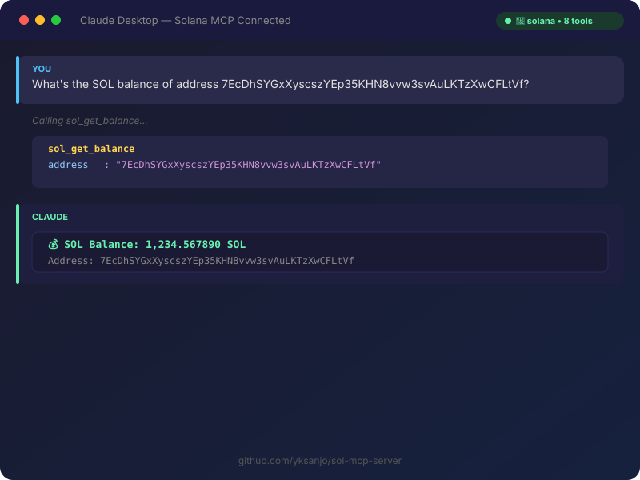

# ☀️ Sol MCP Server

[](https://www.python.org/downloads/)
[](https://opensource.org/licenses/MIT)
[](https://modelcontextprotocol.io)
[](https://github.com/yksanjo/sol-mcp-server/pulls)

**The most comprehensive MCP server for Solana.** Let AI agents check balances, explore tokens, get prices, analyze wallets, and interact with DeFi — all through natural language.

> Built for Claude, Cursor, Cline, and any MCP-compatible AI agent. Covers RPC, Jupiter, and Solscan APIs in one seamless package.

---

## 📸 Demo



*Claude Desktop connected to Solana via MCP — asking about balances, tokens, and wallet analysis*

---

## ✨ What It Can Do

| Tool | Description |
|------|-------------|
| `sol_get_balance` | Check SOL balance for any wallet |
| `sol_get_token_accounts` | List all token holdings for a wallet |
| `sol_get_transactions` | View recent transaction history |
| `sol_get_token_price` | Get current USD price of any token |
| `sol_get_swap_quote` | Get swap quotes via Jupiter DEX |
| `sol_search_token` | Search tokens by symbol or name |
| `sol_analyze_wallet` | Full wallet analysis (balance + tokens + txns + value) |
| `sol_get_gas_price` | Current network fees and priority fees |

---

## 🚀 Quick Start

### With Claude Desktop

Add to your `claude_desktop_config.json`:

```json
{
  "mcpServers": {
    "solana": {
      "command": "uvx",
      "args": ["sol-mcp-server"]
    }
  }
}
```

### With Cursor

```bash
cursor --mcp-server sol-mcp-server
```

### Direct Python

```bash
# Install
pip install sol-mcp-server

# Run
python -m sol_mcp_server.server
```

---

## 💡 Example Prompts

Once connected, try asking your AI agent:

> *"What's the SOL balance of the address 7...?"*
>
> *"Show me all token holdings for this wallet"*
>
> *"What's the current price of BONK?"*
>
> *"Get a swap quote for 1 SOL to USDC"*
>
> *"Analyze this wallet — balance, tokens, recent transactions, and estimated value"*
>
> *"What are the current gas fees on Solana?"*
>
> *"Search for the JUP token"*

---

## 🏗️ Architecture

```
┌─────────────┐     ┌──────────────────┐     ┌──────────────────┐
│  AI Agent   │────▶│  Sol MCP Server  │────▶│  Solana Network  │
│  (Claude,   │     │  (this project)  │     │  (RPC + APIs)    │
│  Cursor...) │     │                  │     │                  │
└─────────────┘     └──────────────────┘     └──────────────────┘
                           │
                    ┌──────┴──────┐
                    │  Data Sources │
                    │              │
                    │ • Solana RPC │
                    │ • Jupiter    │
                    │ • Solscan    │
                    └─────────────┘
```

### Data Sources Used

- **Solana RPC** (`api.mainnet-beta.solana.com`) — Account data, balances, tokens, transactions
- **Jupiter API** — Token prices, swap quotes, DEX routing
- **Solscan API** — Enhanced account data and market info

All public APIs — no API keys required for basic usage.

---

## 🛠️ Development

```bash
# Clone
git clone https://github.com/yksanjo/sol-mcp-server.git
cd sol-mcp-server

# Install deps
pip install -e .

# Run
python -m sol_mcp_server.server
```

---

## 🗺️ Roadmap

- [ ] **NFT Support** — Metaplex NFT portfolio and metadata queries
- [ ] **Raydium/Orca Pools** — Liquidity pool data and analytics
- [ ] **Token Transfer** — Execute SOL and token transfers via AI
- [ ] **DCA Trading** — Automated dollar-cost averaging strategies
- [ ] **Wallet Tracking** — Monitor wallets for incoming/outgoing transactions
- [ ] **Web Dashboard** — Visual interface for non-CLI users
- [ ] **Premium API** — Paid tier with higher rate limits and priority RPC

---

## 🤝 Contributing

PRs welcome! This is the most comprehensive Solana MCP server — let's make it the standard.

- [Open an Issue](https://github.com/yksanjo/sol-mcp-server/issues)
- [Submit a PR](https://github.com/yksanjo/sol-mcp-server/pulls)
- [Join the Solana Discord](https://discord.gg/solana)

---

## 📄 License

MIT

---

<div align="center">
  <strong>⭐ Star if you build on Solana — let's bring AI to the ecosystem!</strong>
  <br>
  <em>Built by <a href="https://github.com/yksanjo">Yoshi Kondo</a> · Music Ai Lab</em>
</div>
